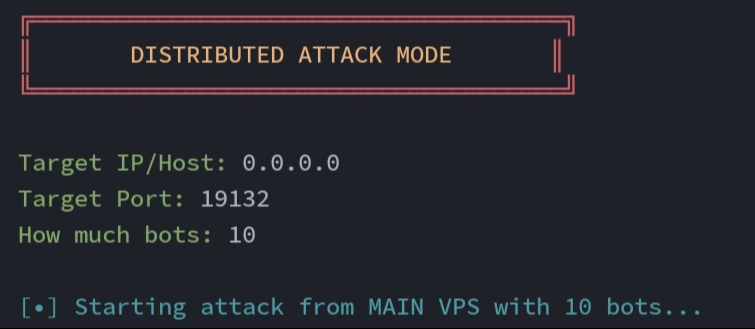

# NullC2
### 📢 About NullC2
**NullC2** is a DDOS script that sends multiple bots to join a server of your choice ( Only 0.15.10 - 0.14.x ).
### 🖼️ Picture
**Banner**


**Attack**


### ✨ Features

- 🤖 Send Bot to join the server you want.
- 🎯 Ip And Port server for the desired target.
- 🗒️ Easily register bot names ( nick.txt )
- 🌐 Connect with multiple VPS or connections

*If you add more VPS or Connections then the number of bots will increase hugely*

#### 🖥️ Appearance

- Simple and minimalist script display
- Easy to use

### 🛠️ Installation
#### 🗒️ Requirements

- 🐍 Python 3+
- 💻 Terminal ( Termux, Linux ( Ubuntu / Debian ), Command Prompt ( Windows )

### 🚀 Steps 
#### Termux
```
pkg update
```
```
pkg install git
```
```
pkg install python
```
```
git clone https://github.com/DanzzuPMP/NullC2
```
```
cd NullC2
```
```
pip install paramiko scp pyfiglet request
```
```
chmod +x nc2
```
```
./nc2
```

#### Command Prompt ( Windows )
```
winget install Git.Git
```
```
winget install Python.Python.3
```
```
git clone https://github.com/DanzzuPMP/NullC2
```
```
cd NullC2
```
```
pip install paramiko scp pyfiglet request
```
```
nc2
```
if not work use
```
python3 nc2
```

#### Linux ( Ubuntu / Debian )
```
apt update
```
```
apt install git
```
```
apt install python3
```
```
git clone https://github.com/DanzzuPMP/NullC2
```
```
cd NullC2
```
```
pip3 install paramiko scp pyfiglet colorama
```
```
chmod +x nc2
```
```
./nc2
```

### 📝 Current Version

- V1.0

### 🌟 Credits

- Owner
**Danzu**
- Made by
**NullC2Team**

*The best Minecraft bot join server ( 0.15.10 - 0.14.x )*

### 📜 Note
***This script will continue to receive updates***
